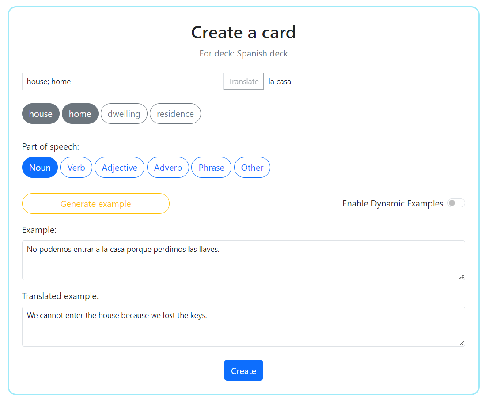
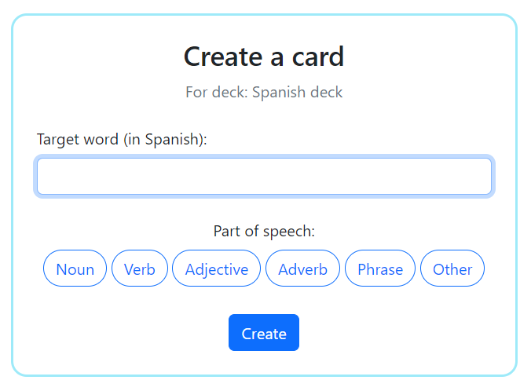

# LangControl

LangControl is a language learning web app that uses flashcards to help you learn new vocabulary.
It was developed out of a need to make flashcards a lot less boring and more relevant to real life than they usually are.
It puts simplicity and ease of use at the forefront.

## Main features

* Automatic translations
* AI-generated example sentences
* Spaced repetition algorithm
* "Zen mode"
* Much more to come...

## Technologies used

* Java 17
* Spring Boot 3
* Java JPA 3.1
* Hibernate
* MySQL 8
* Maven
* HTML5
* CSS3
* JavaScript

## Usage

### Flashcard creation

When creating a new flashcard, you are given several useful tools which should make your learning quicker, easier and more fun.



Clicking the "Translate target word" button will automatically fetch one or more translation suggestions of the word you're planning to learn.

The app can also generate example sentences for you.

The "Dynamic examples" function allows completely new sentences to be generated each time the card is encountered.

Please note that examples are generated by the OpenAI's GPT 4o-mini model and may sometimes contain inaccurate or unwanted results.

### Zen mode

In the settings page, you'll see an option to enable the Zen Mode.

[//]: # (![Enable zen mode setting]&#40;images/settings.png&#41;)

It makes card creation even easier. The user only has to enter the word to learn and its part of speech.

[//]: # ()

The app will **automatically translate the word** into the user's native language and generate examples dynamically by default.

### Learning

Each flashcard can exist in one of two modes: Learn Mode and Review Mode.

#### Learn Mode

Every new card is put into the Learn Mode by default.
It's especially designed for the period when a word is still being actively learned and memorised by the user. It consists of two steps:

 * Step One - the next encounter in 1 minute
 * Step Two - next encounter in 10 minutes


After the Step Two is passed, the card enters the Review Mode. The initial interval for Review Mode is 24 hours.

There are 2 ratings for the Learn Mode:

* Know - choose if the word is easy to recall
* Don't know - choose if the word is difficult to recall

The "Know" rating will step up the Learn Mode step. The "Don't know" rating will step down the Learn Mode step.


#### Review mode

Flashcard in review mode will appear much less frequently (24 hours and above). In this mode, the spaced repetition algorithm
is used when calculating intervals. They become longer, the better the user knows the word.
There are 3 ratings for the Review Mode:

* Remember - choose if the word is easy to recall
* Partially - choose if recall the word with certain difficulty
* Forgot - choose if you forgot the word completely

## How to run

To run this application, you need to have Java JDK 17 or higher, MySQL 8 database and Git installed on your machine.
The app connects to a database named `langcontrol_dev`. Database credentials are saved in `LC_DB_USER` and `LC_DB_PWD` environment variables.

Please note that the app consumes OpenAI's API for content generation as well as DeepL's API for translations.
Thus, access to those API's is required. The authorization keys are provided through environment variables named `OPENAI_API_KEY` and `DEEPL_API_KEY` respectively.
---
1. First clone this repo:
```console
$ git clone https://github.com/jlynxdev/lang-control.git
```

2. Set the following environment variables:
* `LC_DB_USER` - MySQL database username
* `LC_DB_PWD` - MySQL database password
* `LC_OPENAI_API_KEY` - OpenAI API authorization key
* `LC_DEEPL_API_KEY` - DeepL API authorization key
* `LC_ADMIN_USERNAME` - desired username value for the default admin account
* `LC_ADMIN_PWD` - desired password value for the default admin account

3. Go to the root directory of the project and run the following Maven command:
```console
mvn spring-boot:run
```

The app will be available at `localhost:5000`.

## Contributing

Any help or feedback is welcome! If you'd like to contribute or have any ideas, please create an issue to discuss the matter.

## Project status

The project is in an active state and new features are planned.

## License

This project is made available under the [MIT license](LICENSE).
