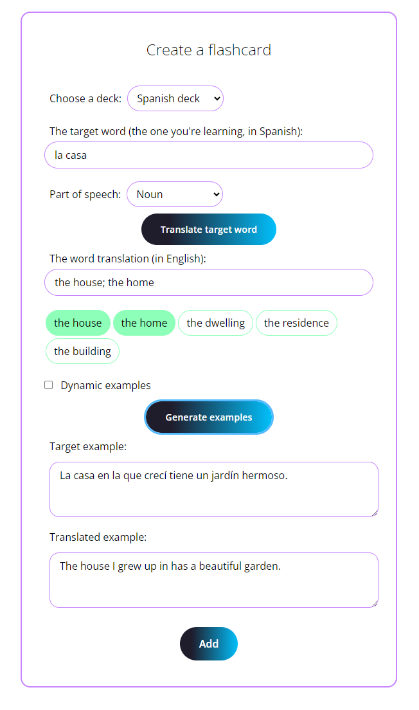

# LangControl

LangControl is a language learning web app that uses flashcards to help you learn new vocabulary.
It was developed out of a need to make flashcards a lot less boring than they usually are and more relevant to real life.
It puts simplicity and ease of use at the forefront.

## Main features

* Automatic translations
* AI-generated example sentences
* "Zen mode"
* Spaced repetition
* Much more to come...

## Technologies used

* Java 17
* Spring Boot 3
* Java JPA 3.1
* Hibernate
* PostgreSQL 15
* Maven
* HTML
* Bootstrap 5
* JavaScript
* Thymeleaf 3.1

## Usage

### Flashcard creation

When creating a new flashcard, you are given several useful tools which should make your learning quicker, easier and more fun.



Clicking the yellow "Translate" button will automatically fetch one or more translation suggestions of the word you're planning to learn.

The app can also generate example sentences for you.

The Dynamic Examples function allows completely new sentences to be generated each time the card gets encountered.

Please note that examples are generated by the OpenAI's GPT 3.5 model and may sometimes contain inaccurate or unwanted results.

### Zen mode

In the settings page, you'll see an option to enable the Zen Mode.


It makes card creation even easier. The user only has to enter the word to learn and its part of speech.


The app will **automatically translate the word** into the user's native language and generate examples dynamically by default.

### Card modes

Each flashcard can exist in one of two modes: Learn Mode and Review Mode.

#### Learn Mode

Every new card is put into the Learn Mode by default.
It's especially designed for the period when a word is still being learned and memorised by the user. It consists of three steps:

 * Step One - next encounter in 1 minute
 * Step Two - next encounter in 10 minutes
 * Step Three - next encounter in 24 hours


After the third step is passed, the card enters the Review Mode. The user can enter the Review Mode earlier by clicking
the "To review mode" button if they feel like the word is already memorised.

#### Review mode

Flashcard in review mode will appear much less frequently (2 days and above). In this mode, the spaced repetition algorithm
is used when reviewing cards. The time intervals become longer, the better the user knows the word.
You have 4 options to rate the card:

* Easy - choose if the word is easy to recall
* Normal - choose if the word is of medium difficulty
* Difficult - choose if the word is hard to recall
* Can't solve - choose if you can't recall the word at all

## How to build

To run this application, you need to have Java JDK 17 or higher, PostgreSQL database and Git installed on your machine.
The app connects to a database named "langcontrol_db" and the database password is saved inside an environment variable `POSTGRES_DB_PWD`. 

First clone this repo:
```console
$ git clone https://github.com/jacekode/lang-control.git
```

Open the project in an IDE of your choice and run the app. The app will be available at `localhost:8080`

---

Please note that the app consumes OpenAI's API for content generation as well as DeepL's API for translations. Thus, access to those API's is required. The authorization keys are provided through environment variables named `OPENAI_API_KEY` and `DEEPL_API_KEY` respectively.

## Contributing

Any help or feedback is welcome! If you'd like to contribute or have any ideas, please create an issue to discuss the matter.

## Project status

The project is in an active state and new features are planned.

## License

This project is made available under the [MIT license](LICENSE).
